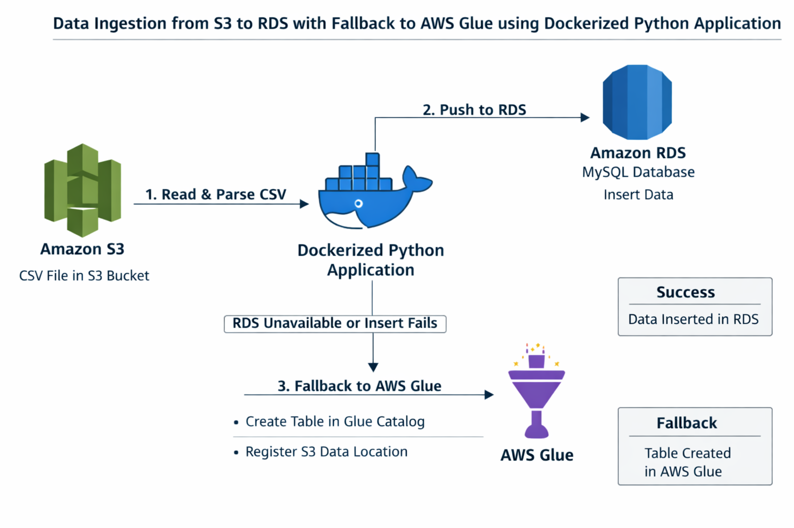
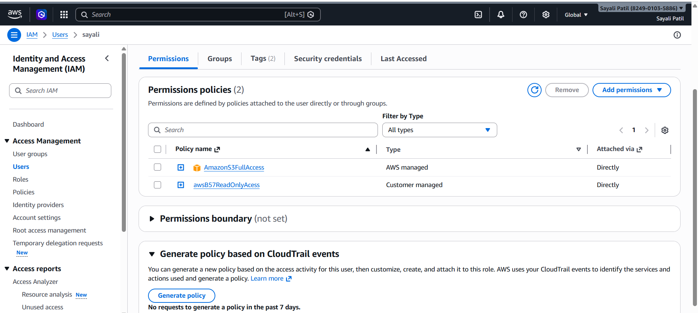
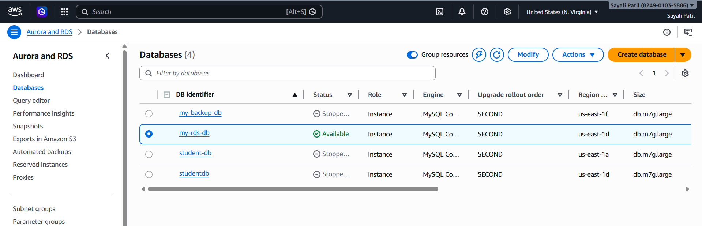
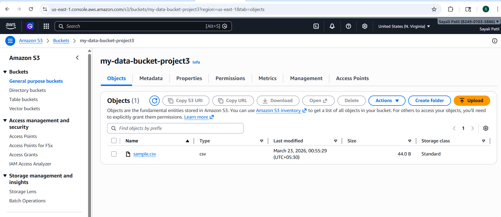
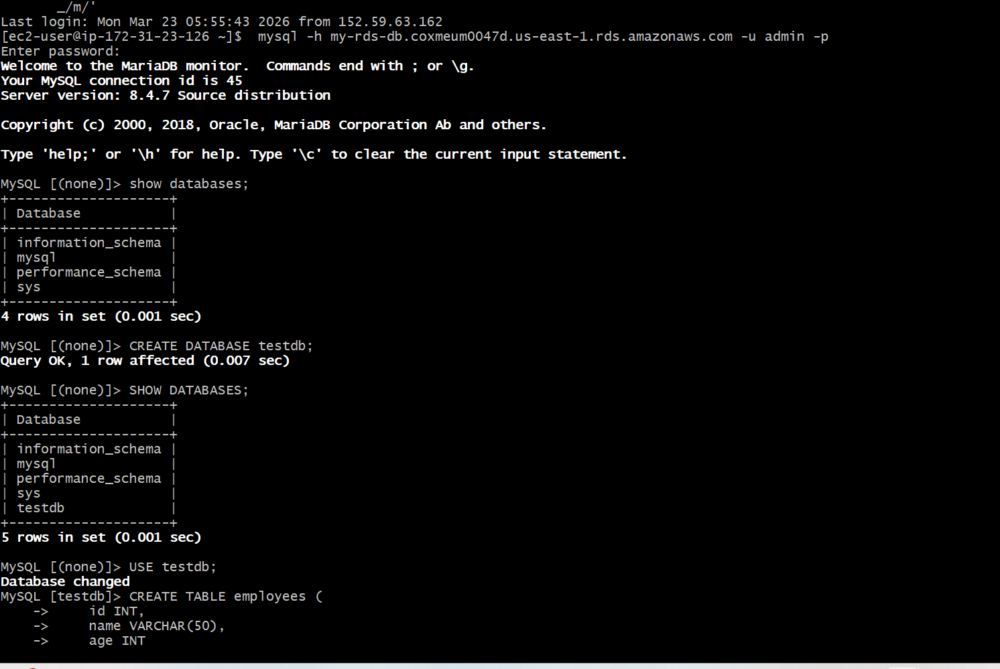
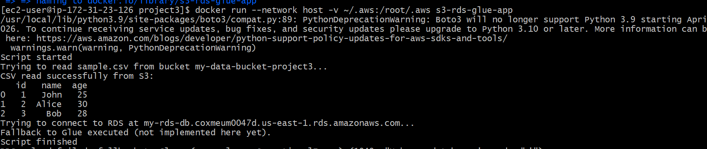
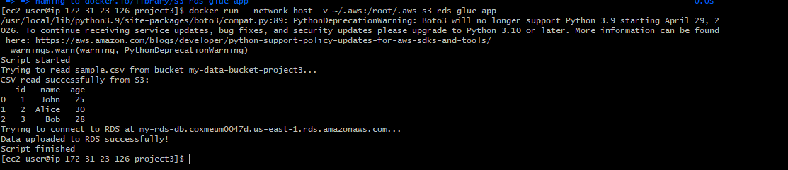
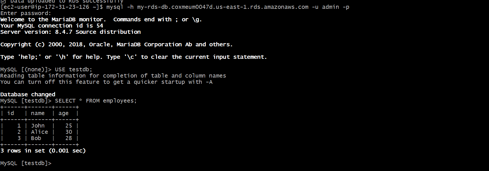

# Project: 3 Data Ingestion from S3 to RDS with Fallback to AWS Glue using Dockerized Python Application

This project implements a **Dockerized Python application** that automates data ingestion from **Amazon S3** into an **RDS MySQL-compatible database**, with a **fallback mechanism to AWS Glue** if the RDS upload fails.  
It demonstrates integration of multiple AWS services (S3, RDS, Glue) and containerization using Docker.

## 🎯 Objectives
- Read data from an S3 bucket (CSV file).
- Push parsed data into an RDS MySQL-compatible database.
- If RDS ingestion fails, automatically:
  - Create a table in AWS Glue Data Catalog.
  - Register the dataset location in S3.

---

## Architecture diagram

## AWS Components Utilized

| **Service / Tool** | **Role in Project** |
| --- | --- |
| **Amazon S3** | Acts as the storage layer, holding the input CSV file (``students.csv``). |
| **Amazon RDS** | Serves as the primary relational database (MySQL-compatible) where ingested records go. |
| **AWS Glue** | Provides a backup option by cataloging the dataset in case RDS ingestion fails. |
| **Amazon EC2** | Runs the Dockerized Python application that orchestrates the data pipeline. |
| **AWS IAM** | Ensures secure access control and permissions across S3, RDS, and Glue operations. |
| **Docker** | Containerizes the Python script, making deployment portable and consistent. |

## Implementation of Project

### 1. IAM User Setup

An IAM user was created with programmatic access.
This user was granted the necessary permissions to securely interact with:

* Amazon S3 → to read the source CSV file.

* Amazon RDS → to insert parsed records into the MySQL-compatible database.

* AWS Glue → to create tables in the Glue Data Catalog and register the dataset location in S3 when fallback is triggered.

###  2️. Infrastructure Setup

* EC2 Instance:

EC2 instance(data-project3) is the backbone of your infrastructure — it runs the Dockerized Python application that orchestrates the entire data ingestion workflow from S3 → RDS → Glue fallback.

* RDS Database

RDS database(my-rds-db) is the central storage layer in your pipeline. The Dockerized Python application first attempts to push ingested data here, and only if this fails does the workflow fall back to AWS Glue for cataloging.

## S3 Bucket & CSV Upload

Amazon S3 is used as the primary data storage layer. A CSV file is uploaded to an S3 bucket, which serves as the input source for the data ingestion pipeline.

🔹 Bucket Creation

A new S3 bucket was created with the following configuration:

     Bucket Name: my-data-bucket-project3
     Region: us-east-1
     Block Public Access: Enabled (for security)
     Upload Status: Succeeded

* CSV File Upload

A sample dataset was prepared in CSV format and uploaded to the S3 bucket.

📄 Sample File: sample.csv

         id,name,age
         1,John,25
         2,Alice,30
         3,Bob,28

     

##  MySQL Database & Table Setup

The Amazon RDS instance was accessed from the EC2 machine using the MySQL command-line tool. After connecting successfully, a new database and table were created to store the student data.

         CREATE DATABASE testdb;
         USE mydb;

         CREATE TABLE employees (
           id   INT,
           name VARCHAR(50)
         );

   

## Python Application & Dockerfile

Python Script (read_s3.py)

⚙️ Script Workflow

The Python script carries out the following operations:

1. Retrieves the students.csv file from the Amazon S3 bucket using the boto3 library
2. Processes and structures the data using the pandas library
3. Tries to insert the processed data into the Amazon RDS MySQL database using SQLAlchemy and PyMySQL
4. If the database insertion fails, the script switches to a fallback mechanism by creating a table in the AWS Glue Data Catalog and linking it to the dataset stored in S3

Dockerfile

     # Use Python base image
    FROM python:3.9

    # Set working directory
    WORKDIR /app

    # Copy file
    COPY read_s3.py .

    # Install libraries
    RUN pip install boto3 pandas sqlalchemy pymysql

    # Run script
    CMD ["python", "read_s3.py"]

Requirements File
- `requirements.txt` includes:

        boto3  
        pandas  
        sqlalchemy  
        pymysql  

## Docker Image Build

The Docker image for this project was successfully created on the EC2 instance using the defined Dockerfile. This process packages the Python application along with all required dependencies into a containerized environment.

           docker build -t s3-rds-glue-app .

  

  

## Container Run & Data Ingestion

The Docker container was started using a .env file that contains AWS credentials and configuration details. This helped the application connect to AWS services and process the data.

 

  

## Data Validation in RDS

After running the container, the inserted data was checked in the Amazon RDS MySQL database by executing a SELECT query to confirm that the records were successfully stored.

          USE testdb;
          SELECT * FROM employees;

 

  

  

 ## Configuration Parameters

 | **Parameter** | **Value / Description** |
| --- | --- |
| **S3 Bucket Name** | ``my-data-bucket-project3`` – stores the source CSV file |
| **CSV File Key** | ``sample.csv`` – the dataset to be ingested |
| **RDS Endpoint** | ``my-rds-db.coxmeum0047d.us-east-1.rds.amazonaws.com`` – connection endpoint for RDS |
| **RDS Username** | ``admin`` – database user for authentication |
| **RDS DB Name** | ``admin123`` – target database where records are inserted |
| **RDS Table Name** | ``employees`` – table schema for storing ingested CSV records |
| **Glue DB Name** | Configured as fallback target – used when RDS ingestion fails |
| **AWS Region** | ``us-east-1`` – region where S3, RDS, and Glue resources are deployed |

## Challenges and Solution

| **Challenge** | **Fix / Solution** |
| --- | --- |
| **RDS Connection Errors** – The Python app couldn’t connect to the RDS instance because of security group restrictions. | Updated the RDS security group to allow inbound MySQL traffic (port 3306) from the EC2 host running the Docker container. |
| **IAM Permissions** – The application initially lacked permissions to access S3 and Glue. | Created an IAM user (``s3-rds-glue-user``) with programmatic access and attached policies for S3 read, RDS write, and Glue catalog operations. |
| **Fallback Handling** – When RDS ingestion failed, the app didn’t properly switch to Glue. | Added error handling in the Python script to catch database exceptions and trigger Glue Data Catalog creation with the S3 path. |
| **Docker Dependency Issues** – Missing libraries caused the container to fail at runtime. | Defined all dependencies (``boto3``, ``pandas``, ``sqlalchemy``, ``pymysql``) in ``requirements.txt`` and rebuilt the Docker image. |
| **Data Validation** – CSV parsing errors occurred with inconsistent data formats. | Used pandas to clean and validate the CSV before attempting insertion into RDS. |

## Conclusion
This project successfully showcased the design and implementation of a cloud‑native data ingestion pipeline using AWS services and Docker.

* A Python application running inside a Docker container on EC2 was able to read a CSV file from Amazon S3, process it with pandas, and insert the records into an Amazon RDS MySQL database using SQLAlchemy and PyMySQL.

* The pipeline was made resilient with an automatic fallback to AWS Glue, ensuring that if RDS ingestion failed, the dataset was still registered in the Glue Data Catalog with its S3 location preserved.

* The containerization with Docker made the application portable, reproducible, and easy to deploy on any EC2 instance.

* All test records from students.csv were successfully ingested into RDS and verified via SQL queries, demonstrating end‑to‑end functionality.

Overall, this hands‑on project provided practical experience in:

* Data pipeline engineering

* Integration of multiple AWS services (S3, RDS, Glue, IAM, EC2)

* Containerized deployment with Docker

It highlights how cloud services and containerization can be combined to build robust, scalable, and fault‑tolerant data workflows.

## 👤 About the Author

Hi, I'm **Sayali Patil** — a passionate Cloud & DevOps Learner ☁️  

📧 Email: rajputsayali1104@gmail.com  
🔗 LinkedIn: [linkedin.com/in/Sayali-Patil-599464362](https://linkedin.com/in/sayali-patil-599464362)  
🐱‍💻 GitHub: [github.com/iamsayalipatil](https://github.com/iamsayalipatil)  
✍️ Medium: [medium.com/@SayaliPatil1104](https://medium.com/@SayaliPatil1104)  
